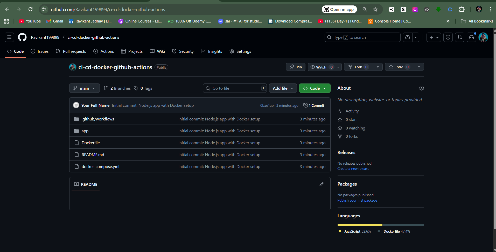

🚀 CI/CD with Docker, GitHub Actions & Kubernetes (Node.js Project)
This project demonstrates a DevOps workflow using Node.js, Docker, GitHub Actions, Docker Hub, Docker Compose, and Kubernetes (with Minikube). It covers end-to-end software delivery, from local development to containerized deployment and CI/CD automation.

---

**1. 📌 Overview & Architecture**

   Developer → GitHub Repo → GitHub Actions CI → Docker Hub
                                   |
                            Local Docker Compose
                                   |
                           Kubernetes (Minikube)

- **Node.js (20.x LTS) → Stable, widely adopted runtime for backend apps.

- **Docker Engine + Docker Compose → Standardized containers & local orchestration.

- **GitHub Actions → CI/CD pipeline integrated with GitHub.

- **Kubernetes + Minikube → (Optional) Cloud-native local deployment.


**📸 Screenshots: ** 


---

**## 2. Environment Setup**

  ### Installations
  
  **Git**  
```bash
# Install via https://git-scm.com/download/win
git --version
```

Purpose: Version control & collaboration.

**Node.js (20.x LTS)**

```bash
# Download & run installer from https://nodejs.org/en/download/
node -v
npm -v
```

Purpose: Runtime for the sample web app.

Docker Desktop + Compose

- **Download & install Docker Desktop for Windows: https://www.docker.com/products/docker-desktop

- ** Enable WSL2 backend (recommended for Windows).

- **Verify:
  ```bash
  docker --version
  docker compose version
  ```

Purpose: Containerization and service orchestration.

**kubectl + Minikube (Optional)**

```bash
# Using Chocolatey (run PowerShell as Admin)
choco install kubernetes-cli minikube -y

# Verify
kubectl version --client
minikube version
```

Purpose: Test Kubernetes deployments locally.

**📸 Screenshots:**


**Interview Qs:**

Q: Why use Node.js LTS for production apps?

Q: How does Docker Compose differ from Kubernetes?

Q: What is the role of GitHub CLI?


**3. Project Scaffolding**

Repo Structure:

.
|-- Dockerfile
|-- README.md
|-- app
|   |-- node_modules
|   |-- package-lock.json
|   |-- package.json
|   |-- server.js
|   `-- server.test.js
|-- deployment.yml
|-- docker-compose.yml
|-- ingress.yml
`-- service.yml


- server.js: Minimal web endpoint (/ and /health).

- server.test.js: Tiny test to validate app.

- Dockerfile: Container build instructions.

- .dockerignore / .gitignore: Ignore unnecessary files.

**📸 Screenshots:**


**4. Docker Build & Run (Local)**
   
Build Image
```bash
docker build -t myapp:latest .
```

Run Container
```bash
docker run -p 3000:3000 myapp:latest
```

Verify
```
curl http://localhost:3000
```

**Concepts Explained:**

- Tags: Labels for versions (latest, git-sha).

- Layers: Each instruction in Dockerfile creates a layer → caching improves builds.

- Caching: Speeds up rebuilds when base layers unchanged.

  
**📸 Screenshots:**


**Interview Qs:**

Q: Difference between Docker image & container?

Q: How does Docker caching improve builds?


**5. GitHub Repository & Branching**

**Steps**

```bash
git init
git remote add origin <repo-url>
git checkout -b feature/add-health-endpoint
```

**Commit Message Convention:**

- feat: for new features

- fix: for bug fixes

- docs: for documentation updates
  

**📸 Screenshots:**




**Interview Qs:**

Q: Why use feature branches in Git?

Q: What is a pull request used for?


**6. GitHub Actions CI Workflow**

Sample Workflow (.github/workflows/ci.yml)

```yaml
name: CI/CD Pipeline

on:
  push:
    branches:
      - main
  pull_request:
    branches:
      - main

jobs:
  build-and-deploy:
    runs-on: ubuntu-latest

    steps:
      - name: Checkout code
        uses: actions/checkout@v3

      - name: Setup Node.js
        uses: actions/setup-node@v3
        with:
          node-version: 20

      - name: Install dependencies
        run: |
          cd app
          npm install

      - name: Run tests
        run: |
          cd app
          npm test

      - name: Build Docker image
        run: |
          IMAGE_NAME=${{ secrets.DOCKER_USERNAME }}/ci-cd-docker-github-actions-app
          docker build -t $IMAGE_NAME:latest .

      - name: Log in to DockerHub
        uses: docker/login-action@v2
        with:
          username: ${{ secrets.DOCKER_USERNAME }}
          password: ${{ secrets.DOCKER_PASSWORD }}

      - name: Push Docker image
        run: |
          IMAGE_NAME=${{ secrets.DOCKER_USERNAME }}/ci-cd-docker-github-actions-app
          docker push $IMAGE_NAME:latest
```


**📸 Screenshots:**


**Interview Qs:**

Q: Difference between jobs: and steps: in GitHub Actions?

Q: Why store credentials in GitHub Secrets?


**7. Docker Hub Integration**

- Authentication: Use Personal Access Token (PAT) not raw password.

- Tag Strategy: Push :latest and :git-sha for traceability.

- Verification: Check Docker Hub UI for uploaded images.
  

**📸 Screenshots:**


**Interview Qs:**

Q: Why use SHA-based tags over latest?

Q: How to secure Docker Hub credentials in CI/CD?


**8. Local Deployment with Docker Compose**

docker-compose.yml

```yml
version: "3.9"   # Latest stable Compose file version

services:
  app:
    image: jonty0731/ci-cd-docker-github-actions-app:latest
    container_name: ci-cd-app
    ports:
      - "3000:3000"     # Map host port 3000 to container port 3000
    restart: always     # Automatically restart if container crashes
    healthcheck:        # Simple health check to ensure app is running
      test: ["CMD", "curl", "-f", "http://localhost:3000"]
      interval: 30s
      timeout: 10s
      retries: 3
```


**Commands**

```bash
docker compose up -d
docker compose logs -f
docker compose down
```

**📸 Screenshots:**


!Add Home Page](screenshots/screenshot-24-app-homepage.png)


**Interview Qs:**

Q: Difference between docker run and docker compose up?

Q: How does a healthcheck work in Docker?


**9. (Optional) Kubernetes with Minikube

Sample Deployment**

```yaml
apiVersion: apps/v1
kind: Deployment
metadata:
  name: ci-cd-app
spec:
  replicas: 2
  selector:
    matchLabels:
      app: ci-cd-app
  template:
    metadata:
      labels:
        app: ci-cd-app
    spec:
      containers:
      - name: ci-cd-app
        image: jonty0731/ci-cd-docker-github-actions:latest
        ports:
        - containerPort: 3000
```

**Commands**

```bash
minikube start
kubectl apply -f deployment.yml
kubectl get pods
kubectl port-forward svc/myapp 3000:3000
```


**📸 Screenshots:**


**Interview Qs:**

Q: Difference between Docker Compose and Kubernetes?

Q: What is the role of a Service in K8s?


**🔧 Troubleshooting**

- If Docker fails: ensure Docker Desktop is running.

- If CI/CD fails: verify secrets and YAML syntax.

- If Minikube fails: allocate sufficient CPU & RAM via Docker Desktop settings.


